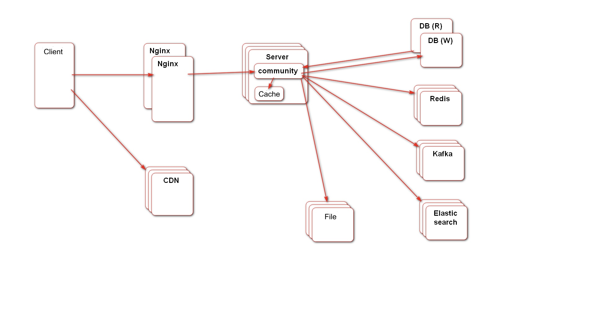

# Lobo Blogging Service
## Introduction
Lobo blogging service is a web service where user publish and comment posts.

## Feature
- Register, login and session management.
- Publish and comment posts.
- Search blog by keywords.
- Send private message.
- Like posts and comments. 
- Support system notification.
- Support user behavior analysis.

## Architecture
- Programming language: Java
- Framework: Spring Boot, Spring Security, Spring MVC, Interceptor
- Database: MySQL, Redis, ElasticSearch
- Message Queue: Kafka
- Plugins: Caffine, Quartz
- Load Balance: Nginx
- Static webpage: CDN

